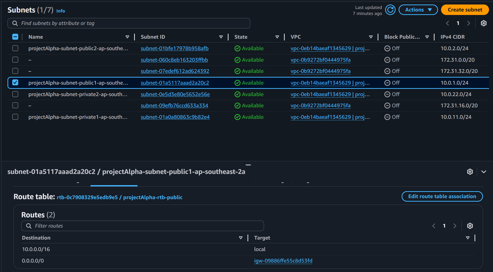
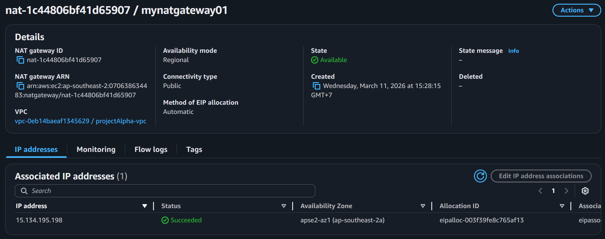
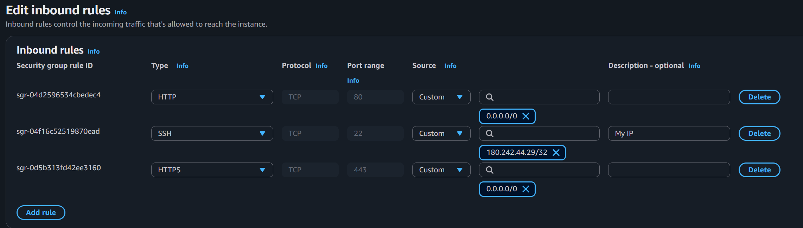
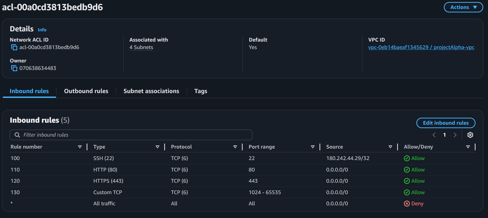

# Day 3: VPC Endpoints, Flow Logs & Network Manager

**Date:** March 15, 2026  
**Time Spent:** ~3 hours  
**Status:** ✅ Complete

---

## What I Learned

### VPC Endpoints

VPC Endpoints let resources inside a VPC access supported AWS services **without sending traffic through the public internet**.

There are two main types:

| Type | Used For | How It Works | Cost | Security Control |
|------|----------|--------------|------|------------------|
| **Interface Endpoint** | Many AWS services via PrivateLink | Creates an ENI in my subnet with a private IP | Paid | Security Groups |
| **Gateway Endpoint** | S3 and DynamoDB only | Adds route table entry using AWS-managed prefix list | Free | Endpoint Policy |

### Interface Endpoints (PrivateLink)
- AWS creates an **Elastic Network Interface (ENI)** inside my subnet
- Traffic stays inside the AWS network
- Route 53 can resolve the service name to the private endpoint IP
- Best for services that need private connectivity from private subnets
- Costs money per endpoint + data processed

### Gateway Endpoints
- Only available for **Amazon S3** and **DynamoDB**
- Free to use
- Instead of creating an ENI, AWS adds a route in the route table
- That route points traffic for S3/DynamoDB to the gateway endpoint
- Traffic stays within AWS instead of going out to public IP addresses

### Flow Logs
- Flow Logs capture **metadata** about traffic, not the packet payload itself
- Can be enabled for:
  - VPC
  - Subnet
  - Network Interface
- Useful for troubleshooting, visibility, and security analysis

### Network Manager
- Provides a dashboard and visualization for network topology
- Useful for seeing connections and monitoring network resources in one place
- I also learned I couldn't properly create/use Network Manager features without the required subscription/setup

---

## What I Built

### VPC Endpoint Learning Setup



Today was less about building a full new architecture and more about understanding **how private access works without NAT Gateway**.

Main things I worked through:

1. **Compared NAT Gateway vs VPC Endpoints**
   - NAT Gateway allows private subnet instances to reach internet/AWS public services
   - VPC Endpoints allow access to supported AWS services **without leaving AWS network**

2. **Learned when to use Interface vs Gateway Endpoints**
   - Interface Endpoint → broad service support, but costs money
   - Gateway Endpoint → only S3 and DynamoDB, but free

3. **Reviewed how routing and security change**
   - Interface Endpoint uses ENI + Security Group
   - Gateway Endpoint uses Route Table + Endpoint Policy

---

## Cost Comparison

| Option | Approx Cost | Notes |
|--------|-------------|-------|
| Interface Endpoint | ~$8.9/month + $0.01/GB | Cost grows as more services are added |
| NAT Gateway | ~$37/month + traffic | May be cheaper if many services are needed |
| Gateway Endpoint | Free | Only for S3 and DynamoDB |

### Key Cost Takeaway
If I only need private access to **S3/DynamoDB**, Gateway Endpoint is the obvious choice.

If I need several private AWS services, I should compare:
- total Interface Endpoint cost
vs
- one NAT Gateway cost

Once the number of endpoints grows, NAT Gateway may be more economical.

---

## Verification Tests

| Test | What I Checked | Result |
|------|----------------|--------|
| Interface Endpoint concept | Uses ENI in subnet with private IP | ✅ Understood |
| Gateway Endpoint concept | Adds route table entry for S3/DynamoDB | ✅ Understood |
| Security model | Interface uses SG, Gateway uses Endpoint Policy | ✅ Confirmed |
| Traffic path | Endpoint traffic stays inside AWS network | ✅ Confirmed |
| Flow Logs purpose | Metadata only, no packet payload | ✅ Confirmed |
| Network Manager usage | Requires more setup/subscription context | ⚠️ Limited access |

---

## Key Observations

### What Worked
- The difference between **Interface** and **Gateway** endpoints became much clearer
- I finally understood that VPC Endpoints are basically a way to avoid using public internet for AWS service access
- The cost comparison with NAT Gateway made the decision-making process more practical
- Flow Logs made sense once I viewed them as **traffic metadata logs**, not packet capture

### What I Learned the Hard Way
- **Not every endpoint works the same way**: Interface and Gateway endpoints are very different under the hood
- **Private access does not mean free**: Interface Endpoints add recurring cost
- **Security responsibility changes**:
  - Interface Endpoint → Security Groups
  - Gateway Endpoint → Endpoint Policies
- **Network Manager isn't just plug-and-play**: I hit limitations trying to create/use it without the required subscription/setup

### What Clicked
- **Gateway Endpoint = route table trick for S3/DynamoDB**
- **Interface Endpoint = private ENI created inside subnet**
- **Flow Logs = network metadata journal**
- **NAT Gateway vs Endpoint = cost + security tradeoff**

---

## Architecture View



```
Private EC2
   │
   ├── Option 1: NAT Gateway ──> Internet / Public AWS service endpoint
   │
   └── Option 2: VPC Endpoint ──> AWS service through private AWS network
```

### Security Context



For Interface Endpoints:
- Access is controlled by **Security Groups**
- Treat the endpoint ENI like another network interface inside the subnet



For Gateway Endpoints:
- Access is controlled with **Endpoint Policies**
- Route tables determine whether traffic goes through the endpoint

---

## What Was Confusing

- At first I thought all VPC Endpoints worked like simple route changes — wrong
- Interface Endpoint using ENI + DNS resolution took a bit longer to click
- The cost difference was not obvious until I compared multiple endpoints against one NAT Gateway
- Network Manager sounded simple in theory, but in practice there were extra requirements/limitations

---

## Questions for Tomorrow

- How do VPC Peering and Transit Gateway compare for connecting multiple VPCs?
- When should I use PrivateLink vs Transit Gateway?
- How do Flow Logs help in real troubleshooting scenarios?

---

## Resources Used

- AWS VPC Endpoints Documentation: https://docs.aws.amazon.com/vpc/latest/privatelink/vpc-endpoints.html
- AWS Gateway Endpoints: https://docs.aws.amazon.com/vpc/latest/privatelink/gateway-endpoints.html
- AWS Flow Logs: https://docs.aws.amazon.com/vpc/latest/userguide/flow-logs.html
- AWS Network Manager: https://docs.aws.amazon.com/network-manager/latest/tgwhat-is-network-manager.html

---

## Tomorrow's Plan

**Day 4: VPC Connectivity Options**
- VPC Peering
- Transit Gateway
- Site-to-Site VPN
- Direct Connect overview
- Compare which connectivity option fits which scenario
