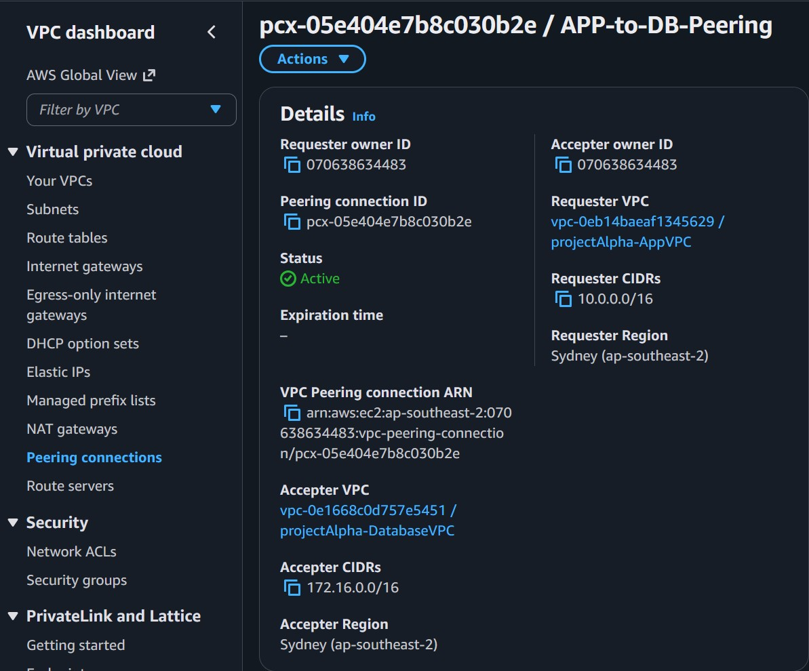
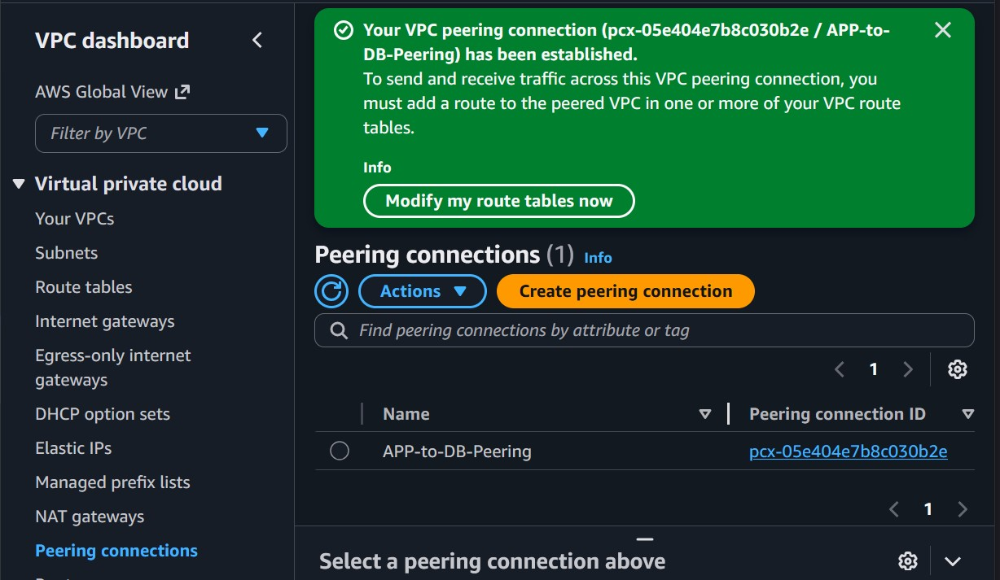
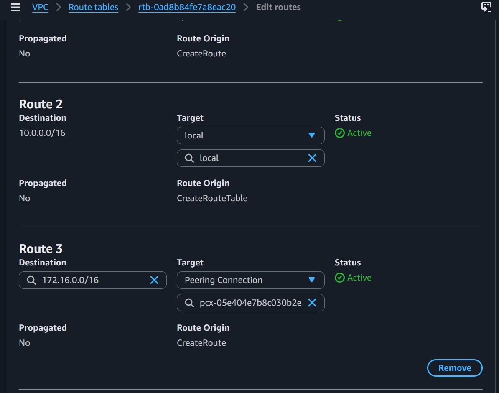
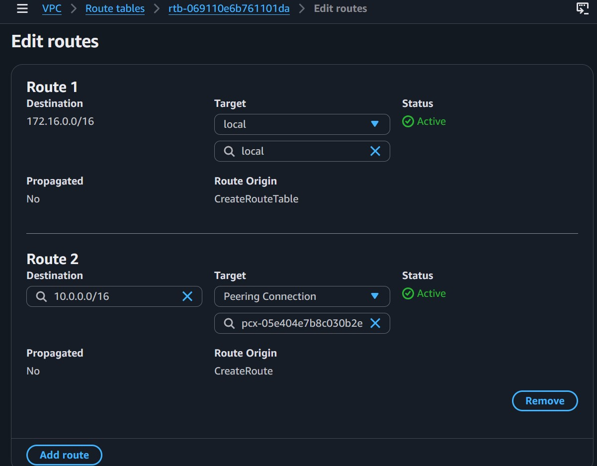
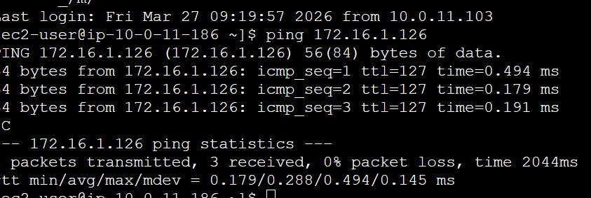
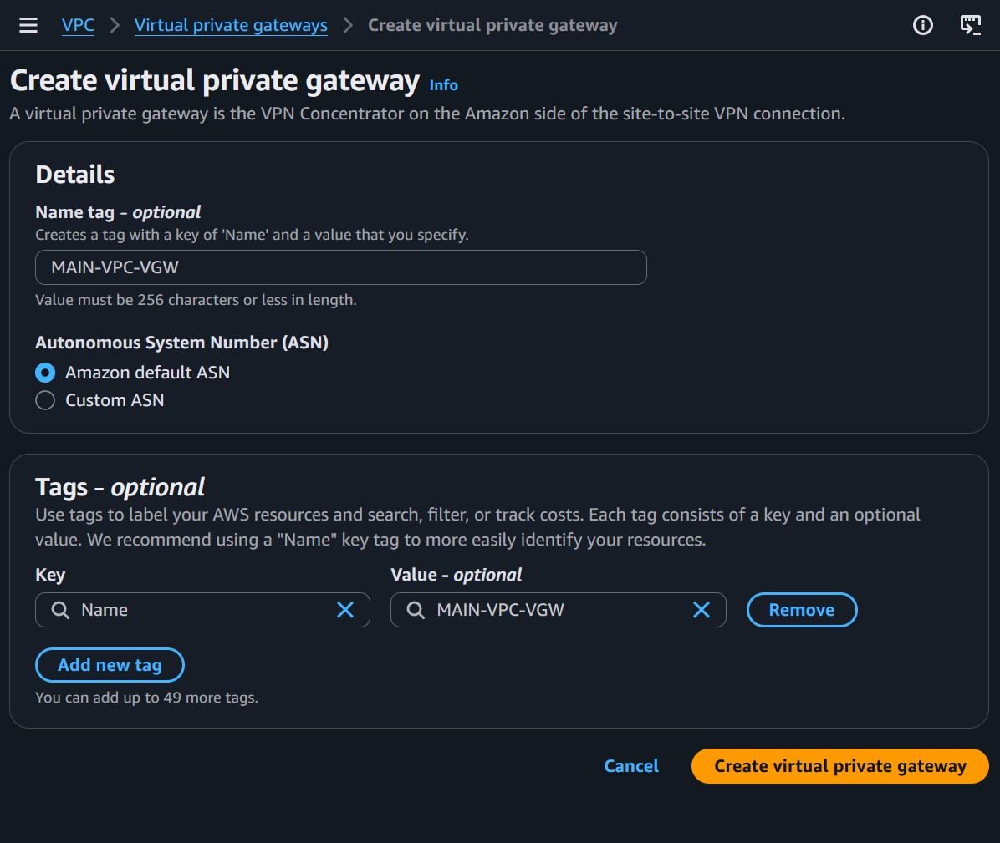
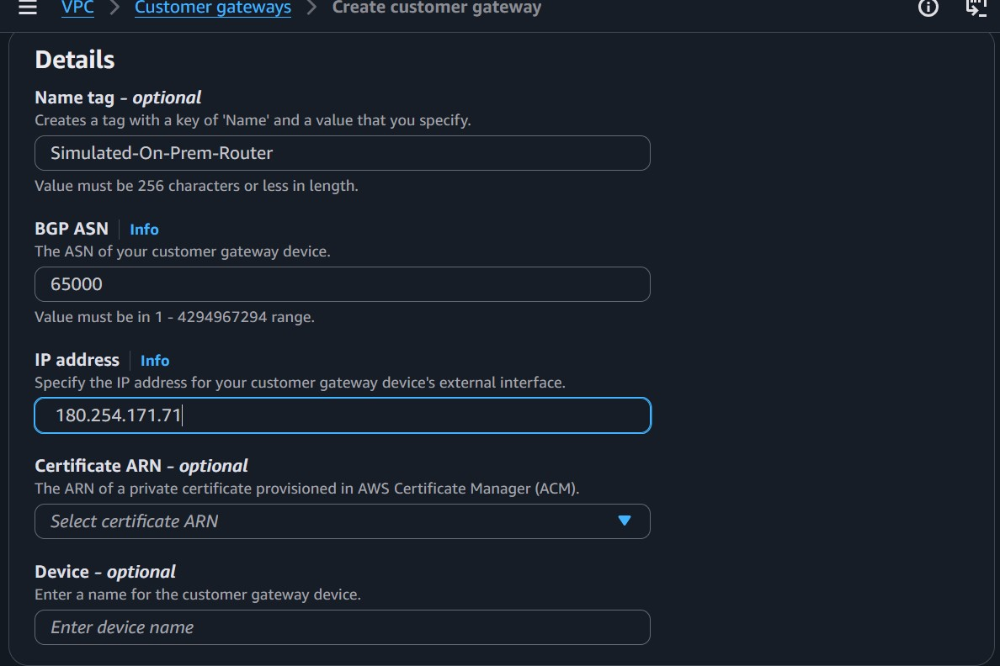
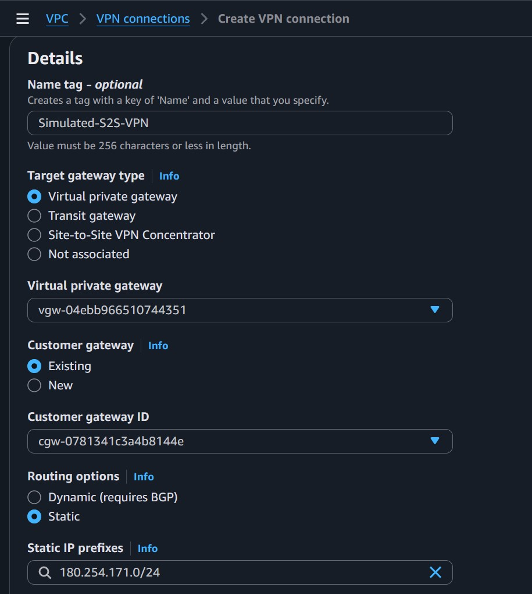
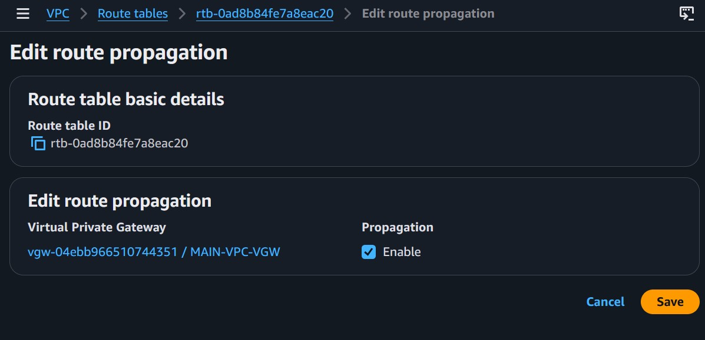

# Day 6: VPC Peering, Site-to-Site VPN & Direct Connect

**Date:** March 30, 2026

---

## What I Learned

### VPC Peering
- One-to-one private connection between two VPCs (same or different accounts/regions)
- Non-transitive: A ↔ B and B ↔ C does NOT mean A ↔ C
- No overlapping CIDRs allowed
- Route tables on BOTH sides must be updated manually

### Site-to-Site VPN (S2S VPN)
- Encrypted IPsec tunnel over the **public internet** connecting on-prem to AWS VPC
- Two tunnels for redundancy (Active/Passive by default)
- Max throughput: ~1.25 Gbps per tunnel
- Attaches to a **Virtual Private Gateway (VGW)** or **Transit Gateway**

---

## Lab Execution Steps

### Lab 1: VPC Peering (App-VPC to Database-VPC)
- [x] Create a second VPC (DatabaseVPC) with CIDR `172.16.0.0/16`
- [x] Create a peering connection (`pcx-05e404e7b8c030b2e`)
- [x] Accept the peering request
- [x] Update route tables on **both** VPCs to point to the peering connection
- [x] Launch and verify connectivity with `ping` (0.2ms latency)

### Lab 2: Site-to-Site VPN (Simulated)
- [x] Create a Virtual Private Gateway (VGW - `vgw-04ebb966510744351`) and attach it to App-VPC
- [x] Create a Customer Gateway (CGW - `cgw-0781341c3a4b8144e`) with simulated IP `180.254.171.71`
- [x] Create a Site-to-Site VPN connection (`Simulated-S2S-VPN`)
- [x] Enable Route Propagation on the VPC route table

---

## Verification Tests

| Test | Command | Expected | Result |
|------|---------|----------|--------|
| VPC A → VPC B ping | `ping 172.16.1.126` | ✅ Success | ✅ Success |
| Route propagation | Check VPC route table | Route for 180.254.171.0/24 visible | ✅ Success |

---

## 🛠️ Key Learnings & Traps Encountered

1. **The "Wait for Acceptance" Step:** You can't just create the peering and expect it to work. One VPC must "Request" and the other must "Accept".
2. **Route Tables are Manual:** VPC Peering does **not** update routes for you. If you forget one side, the ping will time out.
3. **S2S VPN Hidden Cost:** Even in simulation mode, S2S VPN starts charging $0.05/hr immediately.

---

## Resources Used

- AWS VPC Peering: https://docs.aws.amazon.com/vpc/latest/peering/what-is-vpc-peering.html
- AWS Site-to-Site VPN: https://docs.aws.amazon.com/vpn/latest/s2svpn/VPC_VPN.html
