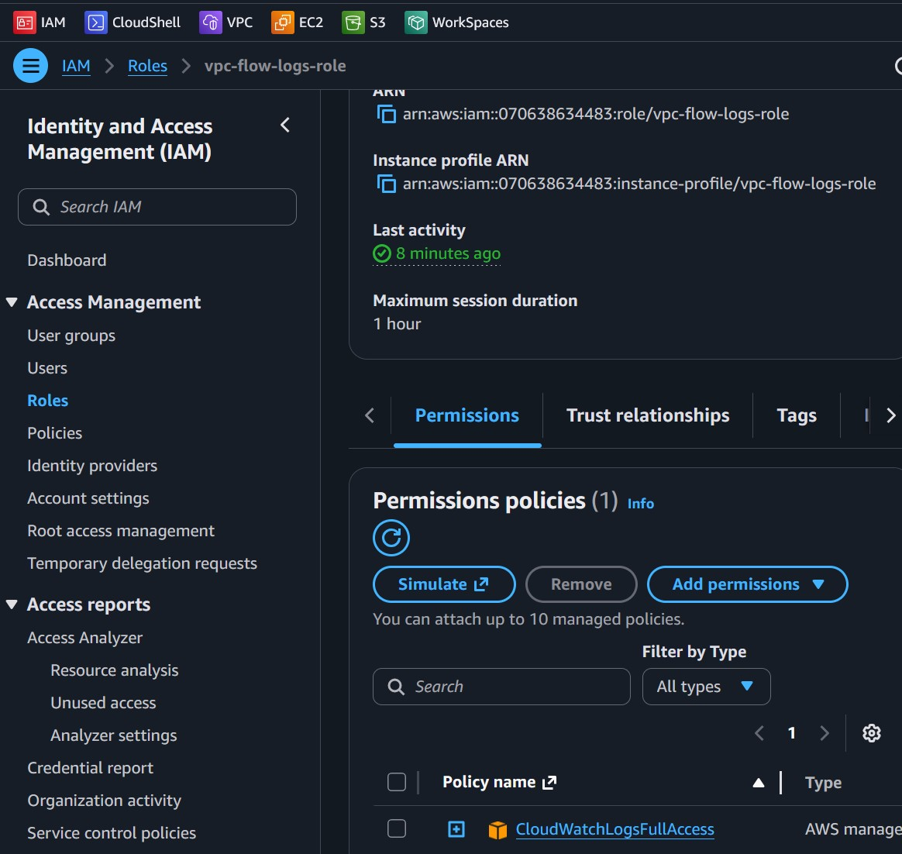
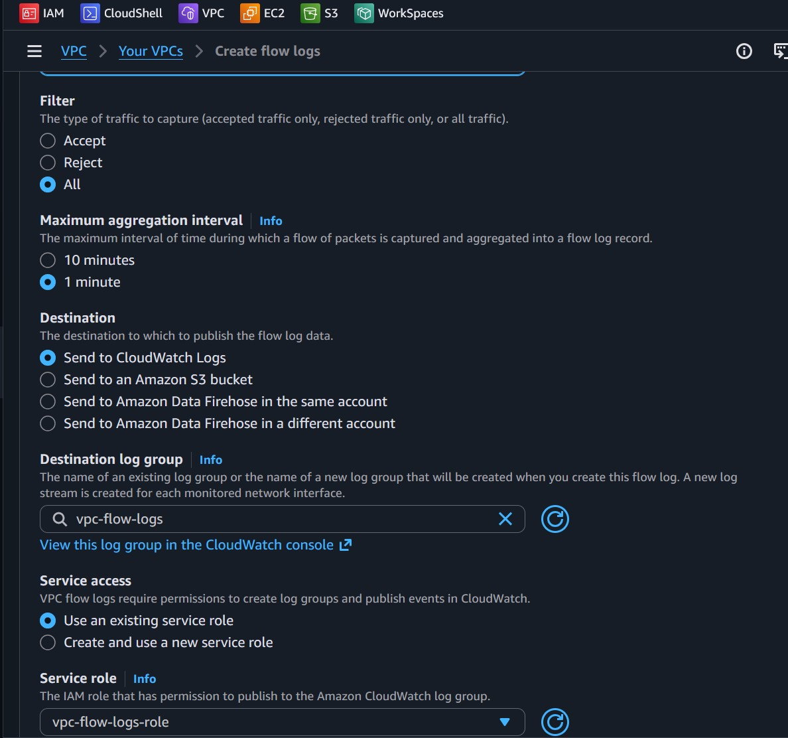
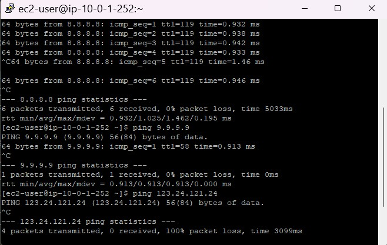
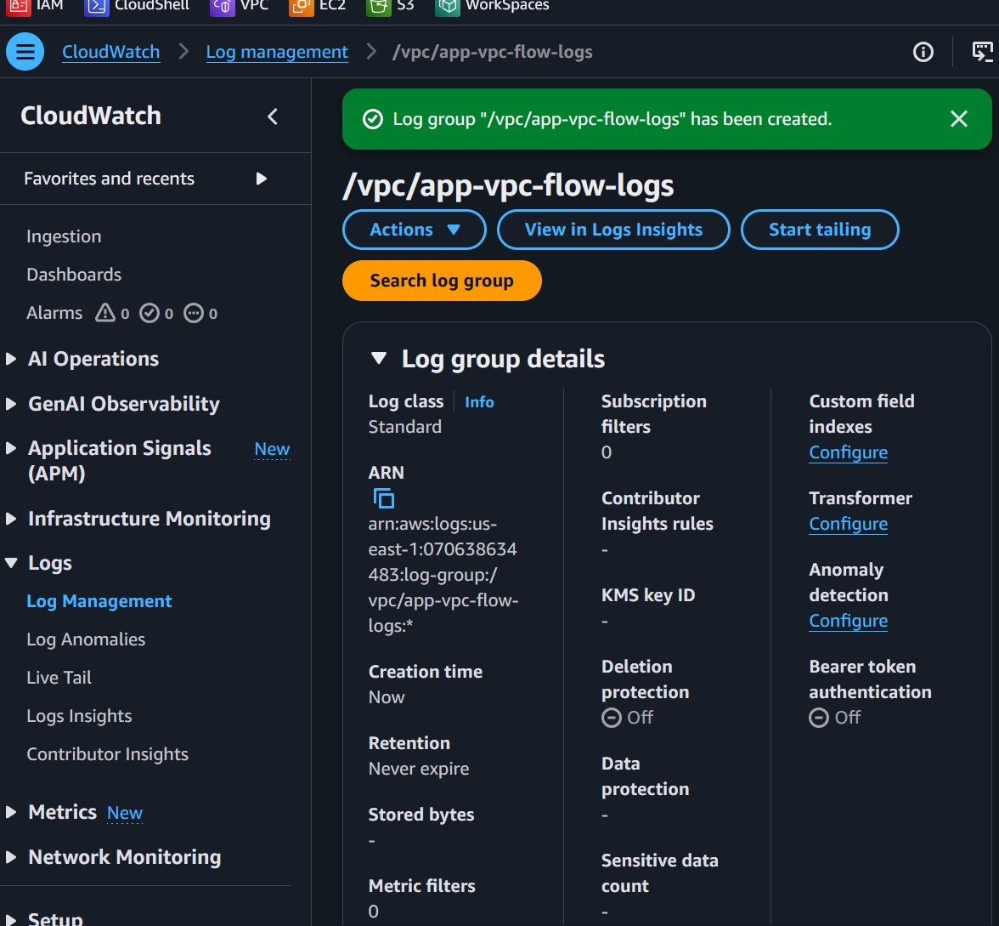
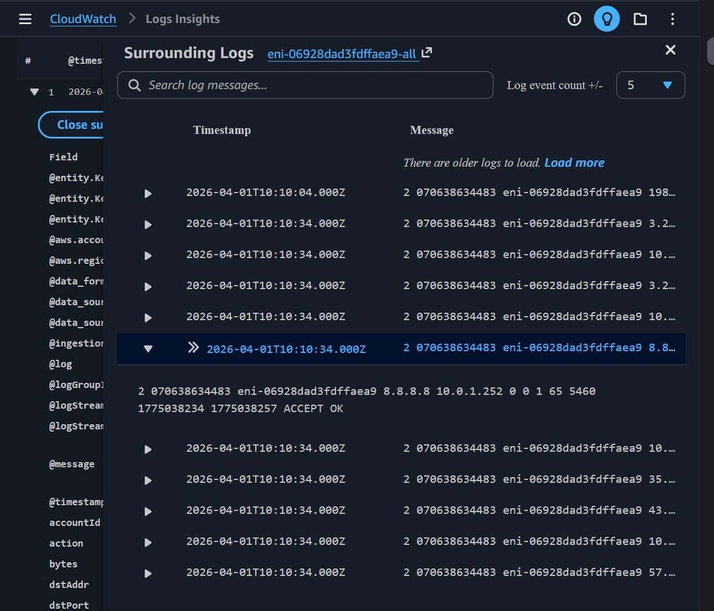
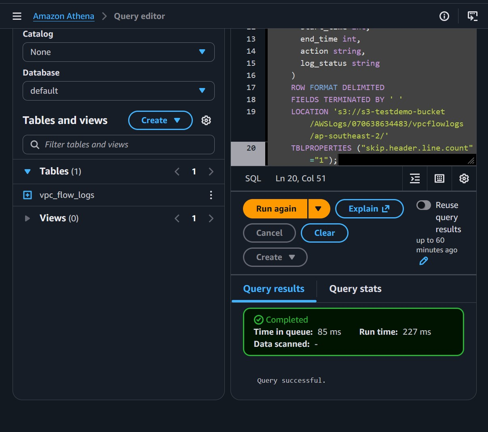
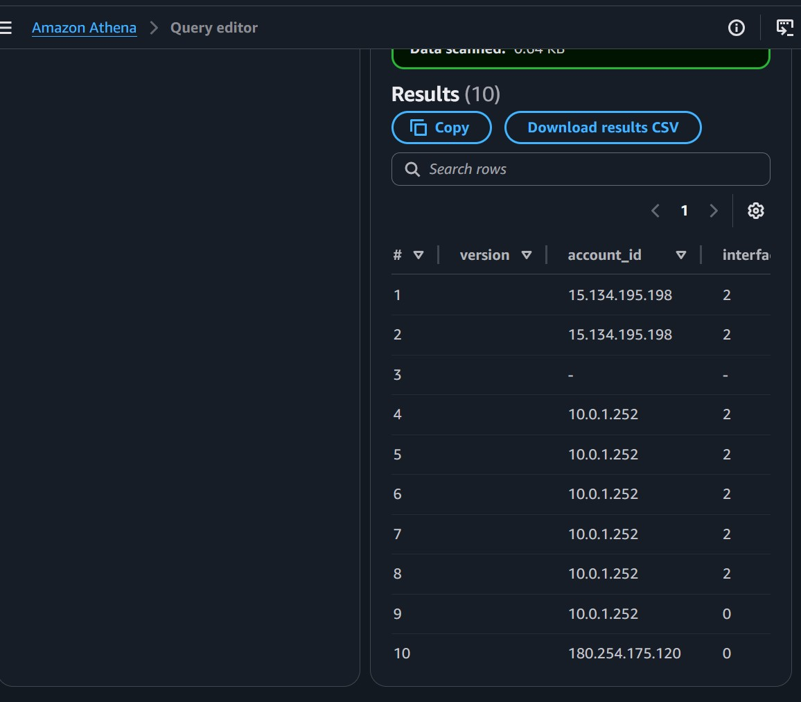
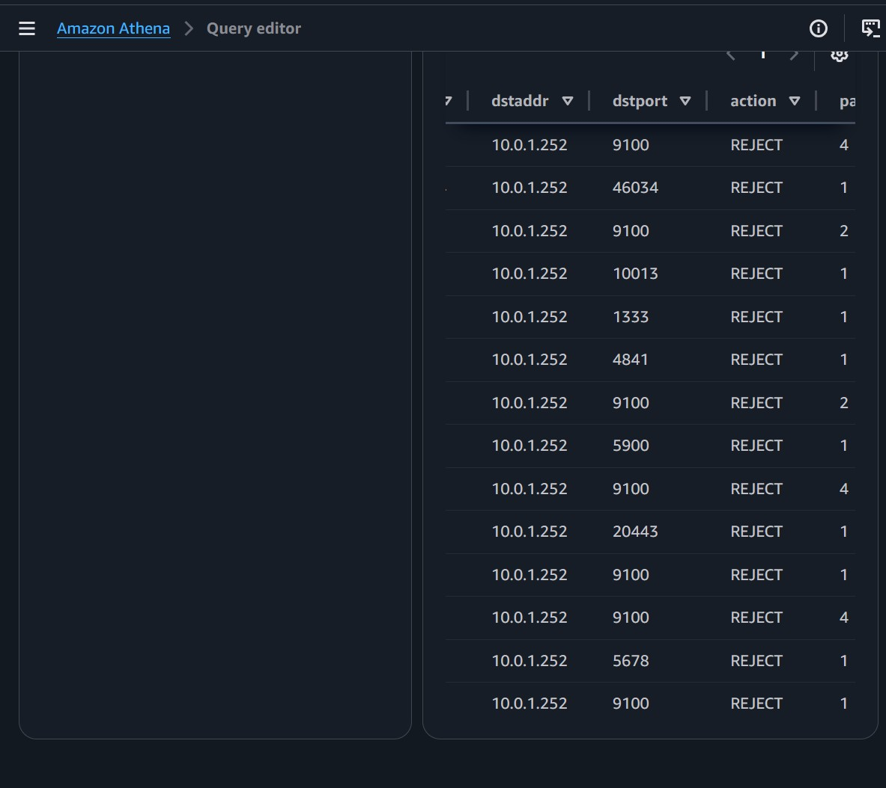

# Day 7: VPC Flow Logs & Network Monitoring

**Date:** April 01, 2026

---

## What I Learned

- **VPC Flow Logs Concept:** Capturing IP traffic metadata going to/from network interfaces natively in AWS.
- **Storage Destinations:** Trading off between CloudWatch Logs (real-time, expensive) vs Amazon S3 (cheaper, Athena required).
- **Analysis:** Flow logs help distinguish between a "routing blackhole" and a "Security Group reject" by seeing `ACCEPT` vs `REJECT` actions in the metadata.

---

## Lab Execution Steps

### Part 1: Enable VPC Flow Logs
- [x] Create an IAM Role for CloudWatch Logs (`vpc-flow-logs-role`)
- [x] Create a CloudWatch Log Group (`/vpc/app-vpc-flow-logs`)
- [x] Enable Flow Logs on `App-VPC` with an aggregation interval of 1 minute.
- [x] Generate Test Traffic by pinging an external IP.

### Part 2: CloudWatch Logs Insights
- [x] Run queries using CloudWatch Logs Insights to filter for traffic records.
- [x] Verify the source IP of the test traffic correctly populated.

### Part 3: S3 & Athena 
- [x] Create an S3 Bucket and enable a second VPC Flow Log publishing to it.
- [x] Set up Athena query results location.
- [x] Create an external table in Athena mapping the VPC flow logs.
- [x] Query the data directly in Athena to find blocked traffic natively.

---

## 🛠️ Key Learnings & Traps Encountered

1. **Ingestion Delay:** Even with a 1-minute aggregation interval, CloudWatch logs can take 5-10 minutes to process and push the first batch of traffic.
2. **CloudWatch Insights Parsing:** Sometimes the default space-separated VPC Flow Logs format isn't auto-detected natively by Insights, requiring explicit `parse @message` statements to map fields correctly.
3. **Athena Setup:** Athena requires a separate S3 bucket path to explicitly store query results before you can execute queries on your VPC logs.
